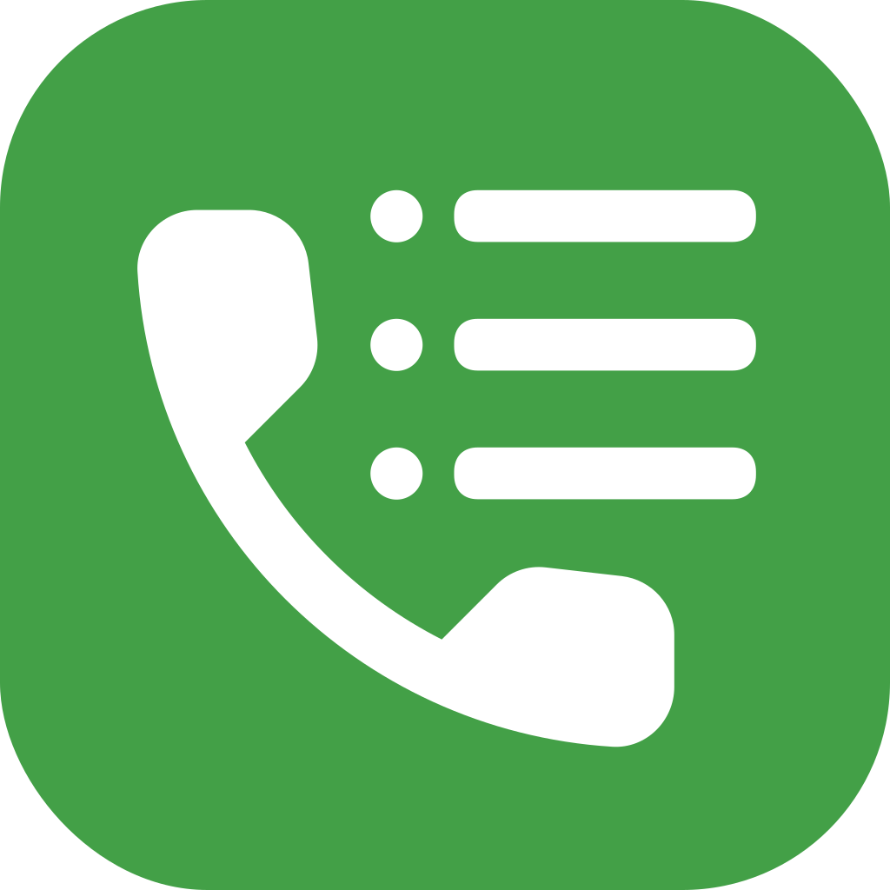
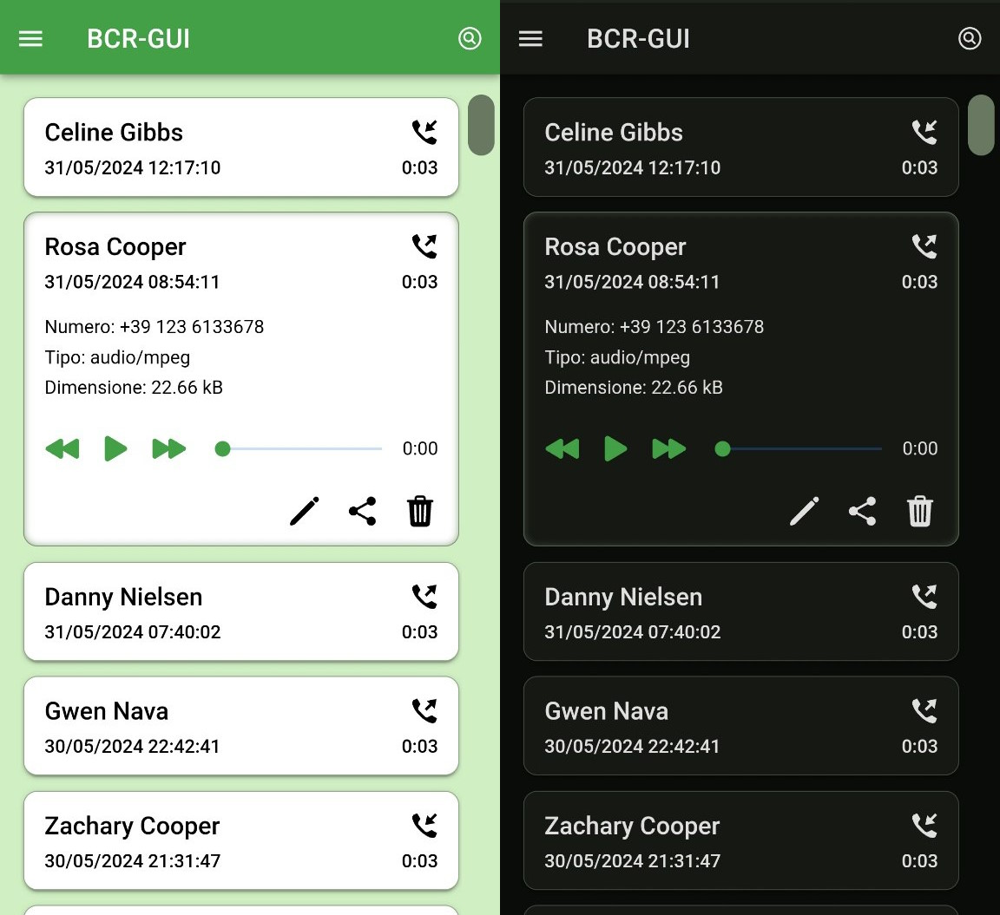

#  BCR-GUI

## What is BCR-GUI

BCR-GUI is a _companion app_ for the great [BCR](https://github.com/chenxiaolong/BCR) (Basic Call Recorder) Android application.

To manage BCR call recordings, you actually need to use a file manager... and thats not so user-friendly 😉.
It's hard to "extract" call informations from audio filename, and its even harder to search them when the list grows.

Such a feature was [already requested](https://github.com/chenxiaolong/BCR/issues/135#issuecomment-1642889831), but **chenxiaolong** (the author of BCR) wants to keep BCR **Basic**; and I do agree with him! Call recording on Android is a hard work, and I'd like (and hope) him to stay focused on it... recordings management is a job made for BCR-GUI 😂.

## Requirements

BCR-GUI needs **BCR v.1.49** (or newer) to work at its best, because it needs the new [JSON call metadata](https://github.com/chenxiaolong/BCR/issues/380) feature to extract and show detailed call info in its call list. In case of missing JSON file (eg. recordings done before 1.49), BCR-GUI tries to extract call data from its filename.

## Permissions

- **BCR-GUI does not need root access** to work. \
  It only needs **READ** access to the directory used by BCR to save recordings. At the first start, it asks you to select your recordings directory (using the well-known [Android SAF](https://developer.android.com/training/data-storage/shared/documents-files) dialogs) and allow read access to it.

- It **does not need Internet access** at all. \
  _NOTE:_ this may change in the future if an auto-update feature will be added, but actually the app can't send/receive anything to/from internet.

## What's working/missing?

BCR-GUI is still in early development stage, but its already usable!

Working:

- list of calls
- play each call straight from the list (no external player needed)

Still missing:

- **share**: allow to share recording file with other apps, like messaging, email, ...
- **edit**: allow user to add **own** data to call recording, like notes, tags, change _numeric_ caller name with a name, ...
- **delete**: this requires **WRITE** access to recordings folder, so I'll implement it later, when the app is well-known and "accepted" by the community

Other things could be improved and added. \
Feel free to share your thoughts!

## Install

BCR-GUI is not available in the PlayStore (...yet).

I'll publish it there if its popularity grows but... since **BCR** is a Magisk module, and it requires some skills to be installed, I'm sure that if you were also able to download & install a simple APK 😉.

Latest version is [available here](https://github.com/nicorac/bcr-gui/releases/).

## Libraries

- Ionic 7
- Capacitor 5 (with custom AndroidSAF plugin)
- Angular 16
- Icons from [Ionicons](https://ionic.io/ionicons/v4) and [FreeSVG (public domain icons)](https://freesvg.org/1547046949)

## License

BCR-GUI is licensed under GPLv3 (please see [`LICENSE`](./LICENSE) file).
